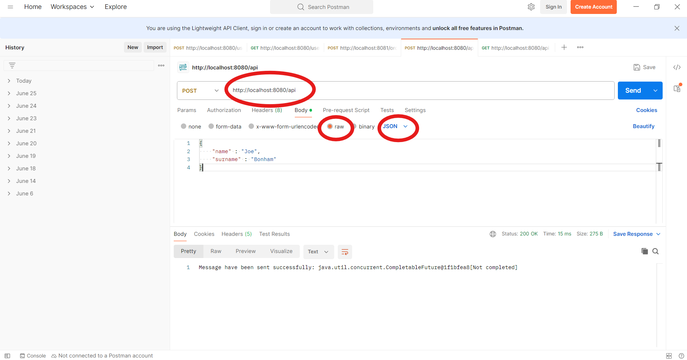

# Kafka Event Streaming System with PostgresSQL Database Integration

### This project demonstrates a simple Kafka event streaming system with PostgresSQL database integration. The system includes components for Kafka, Zookeeper, a Kafka producer, a Kafka consumer, and PostgresSQL.


## Prerequisites

- Docker
- Docker Compose
- Spring Boot
- JDK 21

   **Clone the Repository:**
   ```bash   
  git clone https://github.com/SerobSayadyan/Kafka-simple-project.git
  cd .\Kafka-simple-project\
   ```

   **Build the project**

   ```bash
  ./mvnw clean package -DskipTests
  ```

## Please before running the program make sure you have `.env` file and the environmental variables as shown in [`.env.example`](.env.example)

   **Run Docker Compose:**

   Start Zookeeper, Kafka brokers, database and Producer, Consumer and Controller services by running the following command:

   ```bash
   docker-compose up --build
   ```

# Checking the work
## If you are using just `terminal` fro the requests, please follow the following steps

1. **Sending POST request**

   ```bash
     curl -X POST \
     -H "Content-Type: application/json" \
     -d '{"key1":"value1","key2":"value2"}' \
     http://localhost:8080/api   
   ```
   
   #### or if you're using `Windows PowerShell`
   
   ```shell
   Invoke-RestMethod -Method Post -Uri "http://localhost:8080/api" -Body '{"key1":"value1","key2":"value2"}' -ContentType "application/json"
   ```

2. **Sending GET request**
   ```bash
   curl -X GET "http://localhost:8080/api"
   ```
   #### and for `Windows PowerShell`
   
   ```shell
   Invoke-RestMethod -Method Get -Uri "http://localhost:8080/api"
   ```

   ### You can also send get request with `id`

   ```bash
   curl -X GET "http://localhost:8080/api?id=123"
   ```
   #### and for `Windows PowerShell`

   ```shell
   Invoke-RestMethod -Method Get -Uri "http://localhost:8080/api?id=123"
   ```

## If you're using tools like `Postman` here are the steps for you

1. **Sending POST request**
   ### Write the http://localhost:8080/api on the request bar and add your json to request `Body` 
   
   

2. **Sending GET request**
   ### Write the http://localhost:8080/api on the request bar
   
   